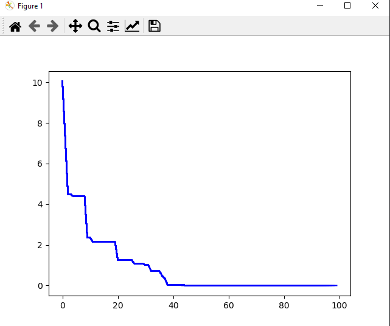

# Particle_Swarm
Second projrect for PSI 
It is an implementation of Particle Swarm algorith that allow you to 
find a minimum and maximum of the function<br />

Examples of the test functions can be found <a href="https://en.wikipedia.org/wiki/Test_functions_for_optimization">here</a><br />

# Example output for Rastrigin function
<br />

<br />

<br />

# HOW TO START
```commandline
git clone https://github.com/MatWich/Particle_Swarm.git
cd Particle_Swarm
pip install -r requirements.txt
python ./main.py
```

